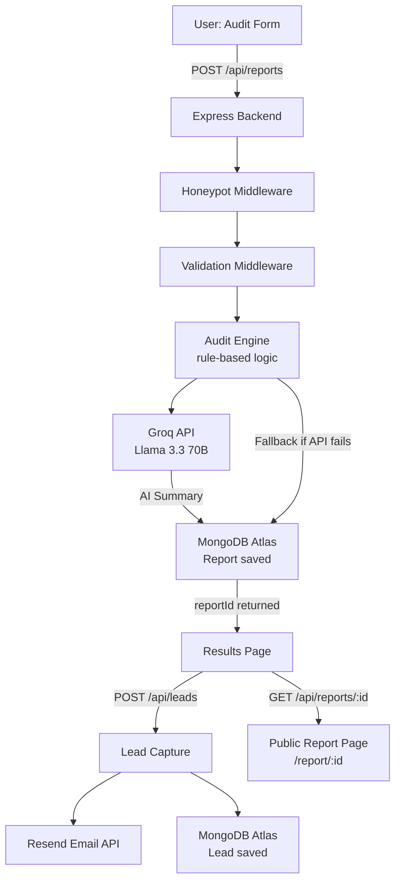

# Architecture

## System Diagram

## Data Flow

1. User fills the audit form — tools, plans, seats, team size, use case
2. Frontend POSTs to `/api/reports` with the full tool array
3. Honeypot and validation middleware run first — bad requests rejected early
4. `auditEngine.js` evaluates each tool against rule-based logic (plan fit, team size thresholds, API spend patterns)
5. Savings are calculated deterministically from `pricingData.js` — every number traces to a vendor URL
6. `generateAISummary.js` calls Groq API to generate a ~100-word personalized summary paragraph
7. If Groq fails, `generateSummary.js` returns a templated fallback — app never crashes on AI failure
8. Full report is persisted to MongoDB with a UUID-based public ID (email/company stripped from public version)
9. Frontend receives the report and navigates to Results page via router state
10. User optionally submits email → lead saved → transactional email sent via Resend
11. Public report URL (`/report/:id`) fetches stripped report data for sharing

## Why This Stack

**React + Vite over Next.js** — No SSR needed. The audit is fully client-driven after the initial API call. Vite's dev speed kept iteration fast across the week. Next.js would have added complexity (SSR, file-based routing) with no benefit for this use case.

**MongoDB over Postgres** — Each audit report is a variable-length document — different users add different numbers of tools with different recommendation counts. MongoDB's document model handles this naturally without schema migrations. Tradeoff: no relational joins if we later want cross-report analytics, but that's a week-2 problem.

**Groq (Llama 3.3 70B) over OpenAI** — Groq's free tier is generous and the API is OpenAI-compatible, meaning zero code restructuring from the original OpenAI integration. Output quality is sufficient for a 100-word audit summary.

**Rule-based audit engine over AI** — Financial recommendations need to be auditable. A finance person should read the reasoning and agree with it. AI-generated recommendations would be unpredictable and hard to verify. AI is reserved for the summary paragraph where creativity adds value, not for the math.

**Honeypot over hCaptcha** — hCaptcha adds friction on a conversion-critical page. A honeypot catches most bots invisibly. Tradeoff: sophisticated bots bypass it, but that's not the realistic threat at this stage.

## What Would Change at 10k Audits/Day

- **Queue the AI summary generation** — Groq calls are synchronous right now. At scale, push them to a job queue (BullMQ + Redis) and return the report immediately, then update the summary async.
- **Add a caching layer** — Reports are immutable after creation. A Redis cache in front of MongoDB for `/api/reports/:id` would cut DB reads significantly.
- **Rate limiting per IP** — Currently only honeypot protection. At scale, add `express-rate-limit` with Redis store to prevent abuse.
- **Index MongoDB on `publicId`** — Public report fetches query by `publicId`. Without an index this is a full collection scan. Add `db.reports.createIndex({ publicId: 1 })`.
- **Separate read/write paths** — Lead capture and report creation are write-heavy. Report fetching is read-heavy. Separate these into distinct services or at least connection pools.
- **CDN for frontend** — Vercel already handles this, but static assets should be served from edge nodes closest to users.