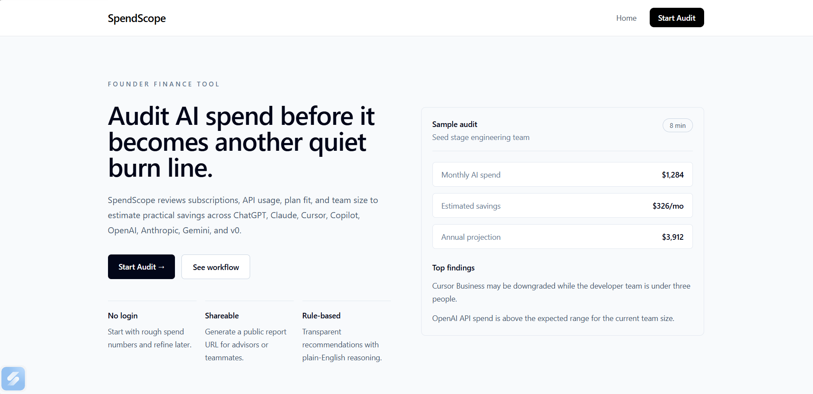
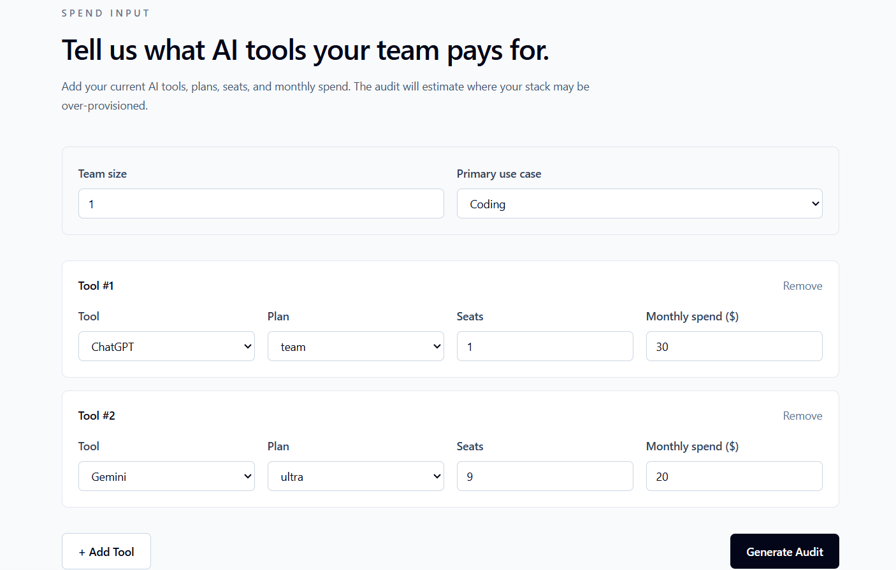
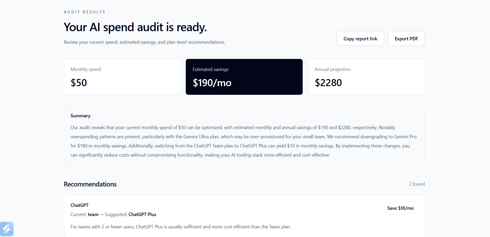
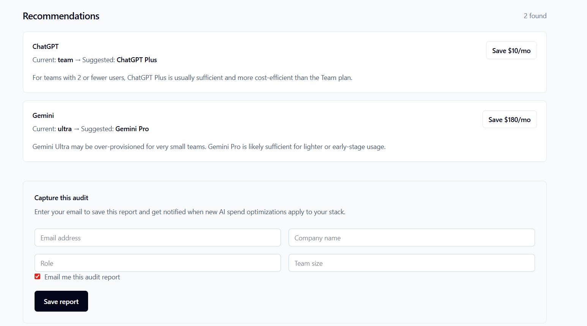

# SpendScope — AI Spend Audit Tool
 
SpendScope is a free web app for startup founders and engineering managers to audit their AI tooling spend, identify overspending, and get actionable savings recommendations across ChatGPT, Claude, Cursor, GitHub Copilot, Gemini, OpenAI API, Anthropic API, and v0.
 
**Live:** [https://spendscope-app.vercel.app](https://spendscope-app.vercel.app)
 
---
 
## Screenshots
 




<video controls src="20260512-2104-20.9098805.mp4" title="Title"></video>
>
> Suggested:
> 1. Landing page
> 2. Audit form filled out
> 3. Results page with savings breakdown
 
---
 
## What it does
 
1. A founder lands on the page and enters what AI tools they pay for, which plan, monthly spend, and team size
2. The audit engine evaluates plan fit, team size mismatch, and API spend patterns
3. An instant results page shows per-tool savings, total monthly + annual savings, and an AI-generated summary
4. The user can optionally capture their report via email
5. Every audit gets a unique public URL for sharing
No login required. Email is captured after value is shown, never before.
 
---
 
## Tech Stack
 
**Frontend**
- React 19 + TypeScript
- Vite
- Tailwind CSS v4
- React Router v7
**Backend**
- Node.js + Express 5
- MongoDB + Mongoose
- Groq API (Llama 3.3 70B) for AI summary generation
- Resend for transactional email
- ES Modules throughout
**Infrastructure**
- Frontend: Vercel
- Backend: Render (Singapore region)
- Database: MongoDB Atlas
---
 
## Quick Start
 
### Prerequisites
- Node.js 18+
- MongoDB Atlas account (or local MongoDB)
- Groq API key (free at [console.groq.com](https://console.groq.com))
- Resend API key (free at [resend.com](https://resend.com))
### Run Locally
 
**Backend:**
```bash
cd Backend
npm install
cp .env.example .env
# Fill in your .env values
npm run dev
```
 
**Frontend:**
```bash
cd Frontend
npm install
cp .env.example .env
# Set VITE_API_URL=http://localhost:3000
npm run dev
```
 
### Environment Variables
 
**Backend `.env`:**
```
PORT=3000
MONGODB_URI=your_mongodb_connection_string
GROQ_API_KEY=your_groq_api_key
RESEND_API_KEY=your_resend_api_key
FRONTEND_URL=http://localhost:5173
```
 
**Frontend `.env`:**
```
VITE_API_URL=http://localhost:3000
```
 
### Deploy
 
**Backend → Render:**
- New Web Service → connect repo
- Root Directory: `Backend`
- Build Command: `npm install`
- Start Command: `npm start`
- Add all env variables
**Frontend → Vercel:**
- Import repo
- Root Directory: `Frontend`
- Build Command: `npm run build`
- Output Directory: `dist`
- Add `VITE_API_URL` env variable
---
 
## Decisions
 
1. **Rule-based audit engine over AI for recommendations** — The assignment specifically called this out. Hardcoded rules with cited pricing data are auditable and defensible to a finance person. AI-generated recommendations would be unpredictable and hard to verify. AI is used only for the summary paragraph where creativity adds value.
2. **Groq (Llama 3.3 70B) over OpenAI for AI summary** — Groq's free tier is generous enough for a demo/submission without requiring billing setup. The OpenAI-compatible API meant zero code restructuring. The tradeoff is less brand recognition, but output quality is comparable for a 100-word summary.
3. **MongoDB over Postgres/Supabase** — Each audit report is a variable-length document (different tools, different number of recommendations). MongoDB's document model fits this naturally without schema migrations as tool coverage grows. Tradeoff: no relational joins if we later want cross-report analytics.
4. **React + Vite over Next.js** — No SSR needed for this use case. The app is fully client-side except for API calls. Vite's build speed kept iteration fast during the week. Tradeoff: no built-in SSR means dynamic OG tags require a backend solution if we want per-report previews server-side.
5. **Honeypot over hCaptcha for abuse protection** — hCaptcha adds friction for real users on a tool whose value depends on low drop-off. A honeypot field is invisible to humans but catches most bots. Tradeoff: more sophisticated bots can bypass it, but at this stage that's not the threat model.
---
 
## Running Tests
 
```bash
cd Backend
npm test
```
 
5 tests covering the audit engine — plan downgrade logic, team size thresholds, API spend flags, and the optimized stack message.
 